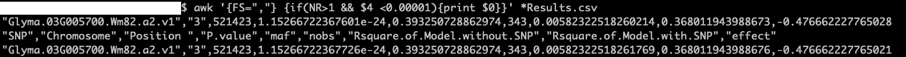
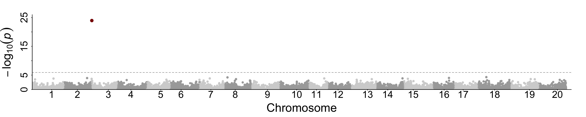

# Soybean TWAS

---


This is aimed to show the three types transcriptome-wide association study (TWAS) in our publication, and give instructions on how to integrate our **soybean SeedlingShoot eQTLs** into your own GWAS.

- [Prerequisites](#Prerequisites)
- [TWAS using measured expression](#TWAS--MeasuredExpression)
- [TWAS using imputed expression -- FUSION](#TWAS--FUSION)
- [TWAS using mendelian randomization -- SMR](#TWAS--SMR)
- [FAQ](#FAQ)   
- [Citation](#Citation)
- [Acknowledgments](#Acknowledgments)

## Prerequisites

-------

Requirements to run the analyses:

- **Data**
  The reads counts for gene and coding exon, expression weights required by FUSION, summary level data required by SMR, and pod color TWAS with three methods are available on [FigShare](https://figshare.com/s/811b3ef0dfc6cba0a167).

  ```
  unzip xxxx.zip
  #readme.txt gave description on the files.
  ```

- **TWAS -- Measured Expression**

  - [R](https://www.r-project.org/)

  - [Rstudio](https://www.rstudio.com/) (R editor, recommended but not required)

  - R packages:

    ```
    #installation of GAPIT -- solution I
    source("http://zzlab.net/GAPIT/GAPIT.library.R")
    source("http://zzlab.net/GAPIT/gapit_functions.txt")

    #installation of GAPIT -- solution II
    install.packages("devtools")
    devtools::install_github("jiabowang/GAPIT3",force=TRUE)
    library(GAPIT3)
    ```

- **TWAS -- SMR** by **[Yang Lab](https://yanglab.westlake.edu.cn)**

  - [SMR](https://yanglab.westlake.edu.cn/software/smr/#Download)

- **TWAS -- Fusion** by **[Gusev Lab](http://gusevlab.org/projects/fusion/)**

  - [R](https://www.r-project.org/)

  - [Rstudio](https://www.rstudio.com/) (R editor, recommended but not required)

  - R packages:

    ```
    #plink2R
    wget https://github.com/gabraham/plink2R/archive/master.zip
    unzip master.zip
    #lunch R
    install.packages(c('optparse','RColorBrewer'))
    install.packages('plink2R-master/plink2R/',repos=NULL)
    ```

## TWAS -- Measured Expression

-------

In a previous [repository](https://github.com/DelinLi/TWAS) from [an indepent publication (Li, 2021)](https://academic.oup.com/plphys/article/186/4/1800/6212071), TWAS with measured expression was described. In the current paper, we extend the measured expression from gene expression to include exon expression and exon proportion (reads ratio of each coding exon in certain gene). By capturing more expression variation, these three types of measured expression allow for a more comprehensive understanding of gene-phenotype associations.

The basic concept behind our approach is to convert the numeric expression or ratio data into a genotype-like numeric format. With this data in hand, we can then use genome-wide association study (GWAS) tools such as [GAPIT](https://zzlab.net/GAPIT/) and [GEMMA](https://github.com/genetics-statistics/GEMMA) to conduct the association analysis between gene/exon expression or ratio and phenotype variation. This approach provides comprehensive results with GWAS.

Take the pod color TWAS with gene expression as an exmaple.

```
    mkdir  Exp
    mv TWAS.MeasuredGeneExpression* Exp/
    mv PodColor.ForAssociation.csv Exp/
    cd Exp/
    #rename the output file, so you can compare yours with it.
    mv TWAS.MeasuredGeneExpression.PodColor.L2.CMLM.Results.csv TWAS.MeasuredGeneExpression.PodColor.L2.Publish.Results.csv
    # If you already had R and the GAPIT package, then run below via terminal (Mac/Win) or any other IDE (like Rstudio)
    Rscript  TWAS.MeasuredGeneExpression.R # this will take couple of minutes

    #Then you will have the output named with TWAS.MeasuredGeneExpression.PodColor.L2.CMLM.Results.csv, couple of commands to compare yours with mine
    grep "Glyma.03G005700" | awk '{FS=","} print ($1,$4)}' *Results.csv # you should see identical results for the L2 gene, Glyma.03G005700, like below

    TWAS.MeasuredGeneExpression.PodColor.L2.CMLM.Results.csv "Glyma.03G005700.Wm82.a2.v1" 1.15266722367601e-24
    TWAS.MeasuredGeneExpression.PodColor.L2.Publish.Results.csv "Glyma.03G005700.Wm82.a2.v1" 1.15266722367726e-24

    awk '{FS=","} {if( $4 <0.00001){print FILENAME,$0}}' *Results.csv

    #see figure below
```



Note: The colnames of `SNP` is the default name from **GAPIT**, but here it's gene ID.

Below is the manhatton plot of Pod Color TWAS with measured gene expression.



## TWAS -- FUSION

-------

I. Download the weight files of Soybean Seedling Shoot *Cis*-eQTL & *Cis*-exonQTL

```
   mkdir FUSION
   mv FUSION.* FUSION
   cd FUSION/
   tar -zxvf FUSION.LDREF.tar.gz
   tar -zxvf eqtl.tar.gz
   tar -zxvf LDREF.tar.gz
   gunzip  FUSION.PodColor.L2.GWAS.gemma.txt
```

II.  Prepare your GWAS results with all input SNPs (NO Filtering). Four columns are required at least. Here, take output of GEMMA GWAS results as an example. And We provided pod color GWAS `FUSION.PodColor.L2.GWAS.gemma.txt` as an example

1. `SNP` – SNP identifier (rsID), the `rs` column, please use Chr-Position as the SNP ID in order to be consistency with the reference panel **LDREF**.

2. `A1` – first allele (effect allele), `allele1` of GEMMA assoc.txt

3. `A2` – second allele (other allele), `allele0` of GEMMA assoc.txt

4. `Z` – Z-scores, `se`/`beta` of  GEMMA assoc.txt.

III. Intergrate the Cis-eQTL & Cis-exonQTL with your GWAS. A `bash` script to run FUSION by chromosome.

```
#!/usr/bin/bash
for chr in {1..20}
do
    Rscript  FUSION.assoc_test.R --sumstats FUSION.PodColor.L2.GWAS.gemma.txt --weights WEIGHTS.SeedlingShoot.pos  --weights_dir WEIGHTS --ref_ld_chr LDREF/Gmax_eQTL_ --chr $chr --out L2.Fusion.${chr}.dat --max_impute 0.6
done
```

IV. for the output, you can use bonferronie cutoff for TWAS pvalue `TWAS.P` (≤0.05/eqtls) to define the associated genes. The files in `out` folder is the output that you supposed to get.
You can campare yours with ours, which was provided as `FUSION.PodColor.Output.zip`.

## TWAS -- SMR

-------

I. Download the summary-level data from the Soybean Seedling Shoot *Cis*-eQTL & *Cis*-exonQTL in binary format.

```
   mkdir SMR
   mv SMR.* SMR
   cd SMR
   tar -zxvf SMR.LDREF.tar.gz
   tar -zxvf SMR.eqtl.tar.gz
   gunzip  GWAS/PodColor.L2.GWAS.gemma.ForFusion.txt.gz
```

II.  Prepare your GWAS results with all your SNPs (NO Filtering). Eight columns are required. Here, take output of GEMMA GWAS results as an example

1. `SNP` – SNP identifier (rsID), the `rs` column, please use Chr-Position as the SNP ID in order to be consistency with the reference panel **LDREF**.
2. `A1` – alternative allele (effect allele), `allele1` of GEMMA assoc.txt
3. `A2` – reference allele (other allele), `allele0` of GEMMA assoc.txt
4. `freq` – frequency of alternative allele (effect allele), `af` of GEMMA assoc.txt
5. `b` – `beta` of GEMMA assoc.txt.
6. `se` – `se` of GEMMA assoc.txt.
7. `p` – `p_wald` of GEMMA assoc.txt.
8. `n` – sample number for GWAS. you can set `NA` as not avalibale.

III. Intergrate the Cis-eQTL & Cis-exonQTL with your GWAS. Take the pod color GWAS as an exmaple.

```
smr --bfile  LDREF/Gmax_eQTL --gwas-summary GWAS/PodColor.L2.assoc.gemma.ForSMR.txt  --beqtl-summary  eqtl/SeedlingShoot --out PodColor.L2.SMR
```

IV. The output file, you can use bonferronie cutoff for TWAS pvalue `p_SMR` (≤0.05/eqtls) and heidi test pvalue `p_HEIDI` ≥ 0.05 define the associated genes. Personal experience is that focus on `p_SMR`  cutoff. `p_HEIDI` didn't help in our known genes.
You can campare your results with ours, which was provided as `SMR.output.PodColor.L2.gz`.

## FAQ

-------

Welcome any question to make TWAS easily accessible for the plant community.

1. My trait tissue is not related with the `seedling shoot`, could I use this eQTL data?
   Answer: Yes. We did successfully get the known gene of trait from non-realted tissue, including disease resistance traits. It's certainly worth for a try. But you need to be careful with a possible higher false positive rate.
2. What do you mean *Cis*-eQTLs and *Cis*-exonQTLs?
   Answer: (1) eQTLs: genetic loci regulating gene expression (the trait); exonQTLs: genetic loci regulating exon reads proportion in certain gene. (2) We focused on *Cis*, which is likely the causal vairiations to decarese the false positives. (3) exonQTLs could capture alternative splicing and are more sensitive to structural virations (InDel, Gene fusion ...).

## Citation

-------

1. If you use the data of this respository, please cite our **preprint**:
   [Li D, Wang Q, Tian Y  *et al.* Transcriptome brings variations of gene expression, alternative splicing, and structural variations into gene-scale trait dissection in soybean. bioRxiv. 2023:2023-07.](https://doi.org/10.1101/2023.07.03.545230)

2. The first soybean TWAS using meaured expression data, had conclusion that TWAS is roubust with source of expression data:
   [Delin Li, Qiang Liu, Patrick S Schnable. TWAS results are complementary to and less affected by linkage disequilibrium than GWAS, Plant Physiology, Volume 186, Issue 4, August 2021, Pages 1800–1811, https://doi.org/10.1093/plphys/kiab161](https://academic.oup.com/plphys/article/186/4/1800/6212071)

3. Citation for software and method of **SMR**:

   [Zhu, Z., Zhang, F., Hu, H. *et al.* Integration of summary data from GWAS and eQTL studies predicts complex trait gene targets. *Nat Genet* 48, 481–487 (2016). https://doi.org/10.1038/ng.3538](https://www.nature.com/articles/ng.3538)

4. Citation for script and method of **Fusion** :

   [Gusev, A., Ko, A., Shi, H. *et al.* Integrative approaches for large-scale transcriptome-wide association studies. *Nat Genet* 48, 245–252 (2016). https://doi.org/10.1038/ng.3506](https://www.nature.com/articles/ng.3506)

## Acknowledgments

-------

- **SMR** by **[Yang Lab](https://yanglab.westlake.edu.cn)**
- **Fusion** by **[Gusev Lab](http://gusevlab.org/projects/fusion/)**
- **GAPIT** by **[Zhiwu Zhang Lab](https://zzlab.net)**
- Thanks for support from **National Natural Science Foundation of China** (32201759) and  **National Key Research and Development Program of China** (2021YFD1201601).
